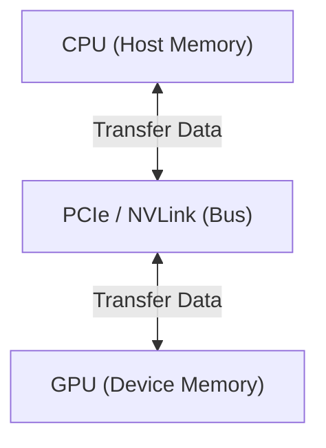

# Stanford CS336: Large Language Models

[video](https://www.youtube.com/watch?v=msHyYioAyNE&list=PLZ959LONyLHz6W_4zcgkGXXNin7nSRnXO)

[slides](https://web.stanford.edu/class/cs336/)


## Class 1: Tokenization
- **Tokenization**: Process of converting text into smaller units (tokens).

Example:
```
"Apple is looking at buying U.K. startup for $1 billion"
tokens: ["Apple", "is", "looking", "at", "buying", "U.K.", "startup", "for", "$", "1", "billion"]
IDs: "Hello world" -> [101, 7592, 2088, 102]
```

1. BPE (Byte Pair Encoding):
   - Merges frequent pairs of characters into single tokens.
   - Example: "l" and "o" in "hello" might be merged into "lo".

2. WordPiece:
    - Similar to BPE but uses a different merging strategy.
3. SentencePiece:
    - Language-agnostic tokenization.
    - Useful for multilingual models.

## Class 2
### Memory counting
1. Float32: 4 bytes, full precision.
2. Float16: 2 bytes, half precision.
    - Potential overflow or underflow. (1e-10 -> 0)
    - unstable training.
3. BFloat16: 2 bytes, float16 with dynamic rage

Intuiation:
1. Trainig with float32 works, but is slow and memory-intensive.
2. Training with lower precision is risky and instability.

Solution: Mixed Precision Training

### Compute Counting


#### Tensor slicing
Many operations dose not copy a tensor, but create a **view** of the original tensor. (Only modify the pointers to the data, not the data itself.)

Example operations:
1. Slicing
2. Transposing
3. Reshaping

Note:
Some views are contiguous, some are not. Non-contiguous views may require additional memory for the new shape.

#### So, how`s the cost?
FLOP/s

| Model | FLOPs required |
| ------ | --------------- |
| GPT-3 | 3.14e23 FLOPs |
| GPT-4 | 2e25 FLOPs |

H100 (peak): 1979 teraFLOP/s (sparsity), 50% with unsparsity.
```txt
8 H100 GPUs for 1 week:
total_flops = 8 * (60 * 60 * 24 * 7) * 4.788e+21 FLOPs
```

---

For a multiply operation:

```txt
x = torch.randn(B, D, device="cuda")
w = torch.randn(D, K, device="cuda")
y = torch.matmul(x, w)
```
The 2 comes from: multiply and add  
| num_flops = 2 * B * D * K

---

For a gradient computation:

```txt
x = torch.randn(B, D, device="cuda")
w1 = torch.randn(D, D, device="cuda")
w2 = torch.randn(D, K, device="cuda")
Model: x--w1 -> h1--w2 -> h2 -> loss
h1 = x @ w1
h2 = h1 @ w2
loss = h2.pow(2).sum()
```

Forward:
1. Multiply (x @ w1): 2 * B * D * D
2. Multiply (h1 @ w2): 2 * B * D * K

Backward:
1. h1.grad = d loss / d h1
2. h2.grad = d loss / d h2
3. w1.grad = d loss / d w1
4. w2.grad = d loss / d w2

For w2, the gradient is computed as:
w2.grad[j,k] = sum_i h1[i,j] * h2.grad[i,k]
For each element, multiply and add:

| num_flops = 2 * B * D * K

For h1, the gradient is computed as:
h1.grad[i,j] = sum_k h2.grad[i,k] * w2[j,k]
For each element, multiply and add:
| num_flops = 2 * B * D * K

Still, for w1, the gradient is computed as:
w1.grad[j,k] = sum_i x[i,j] * h1.grad[i,k]
For each element, multiply and add:

| num_flops = (2 + 2) * B * D * D (w1 is D x D)

---

In summary:
Forward pass: 2 * (#data points) * (#parameters)
Backward pass: 4 * (#data points) * (#parameters)
Total: 6 * (#data points) * (#parameters)