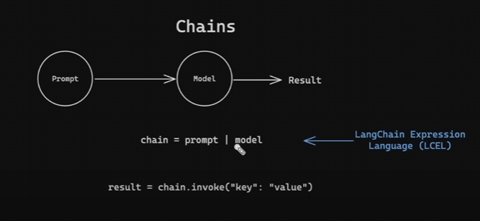
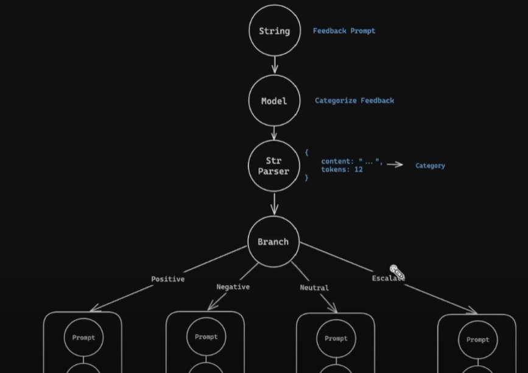

# LangChain

[video](https://www.youtube.com/watch?v=yF9kGESAi3M&t=4709s)

## Basic Usage

```python
from langchain import OpenAI
llm = OpenAI(model="gpt-3.5-turbo", temperature=0.7)
response = llm.invoke("What is the capital of France?")
print(response)
```

### Using a Prompt Template

```python
from langchain import OpenAI, PromptTemplate
llm = OpenAI(model="gpt-3.5-turbo", temperature=0
response = llm.invoke(
    PromptTemplate(
        input_variables=["country"],
        template="What is the capital of {country}?",
    ).format(country="France")
)
print(response)
```

### Real time Chat

```python
# user conversation

from langchain_core.messages import AIMessage, SystemMessage, HumanMessage

chat_history = []

System_message = SystemMessage("Translate the following from English into Chinese")
chat_history.append(System_message)

while True:
  query = input("You: ")
  if query.lower() == "quit":
    break
  messages = chat_history + [HumanMessage(content=query)]
  response = model.invoke(messages).content
  chat_history.append(HumanMessage(content=query))
  chat_history.append(AIMessage(content=response))
  print(f"AI: {response}")
```

## Chain



```python
from dotenv import load_dotenv
from langchain.prompts import ChatPromptTemplate
from langchain.schema.output_parser import StrOutputParser
from langchain_google_genai import ChatGoogleGenerativeAI

load_dotenv()
model = ChatGoogleGenerativeAI(model="gemini-2.0-flash")

prompt_template = ChatPromptTemplate.from_messages(
    [
        ("system", "You are a helpful assistant."),
        ("user", "What is the capital of {country}?"),
    ]
)

chain = prompt_template | model | StrOutputParser()
response = chain.invoke({"country": "France"})
print(response)
```

### Under the Hood

```python
model = ChatGoogleGenerativeAI(model="gemini-2.0-flash")
prompt_template = ChatPromptTemplate.from_messages(
    [
        ("system", "You are a helpful assistant."),
        ("user", "What is the capital of {country}?"),
    ]
)

format_prompt = RunnableLambda(lambda x: prompt_template.format(**x))
invoke_model = RunnableLambda(lambda x: model.invoke(x.to_messages()))
parse_output = RunnableLambda(lambda x: x.content)

chain = RunnableSequence(first=format_prompt, middle=invoke_model, last=parse_output)
response = chain.invoke({"country": "France"})
print(response)
```

### Extended Chain

```python
model = OpenAI(model="gpt-3.5-turbo", temperature=0.7)
prompt_template = PromptTemplate(
    [
        ("system", "You are a helpful assistant."),
        ("user", "What is the capital of {country}?"),
    ]
)

uppercase_output = RunnableLambda(lambda x: x.upper())
count_characters = RunnableLambda(lambda x: len(x))

chain = prompt_template | model | StringOutputParser() | uppercase_output | count_characters
response = chain.invoke({"country": "France"})
print(response)  # Output: 6
```

## Parallel Chains

Example: Analyzing pros and cons simultaneously.


```python
model = ChatGoogleGenerativeAI(model="gemini-2.0-flash")

prompt_template = ChatPromptTemplate.from_messages(
    [
        ("system", "You are a helpful assistant."),
        ("user", "List the features of {product}."),
    ]
)

def analyze_pros(features):
    pros_template = ChatPromptTemplate.from_messages(
        [
            ("system", "You are a helpful assistant."),
            ("user", "Given these features: {features}, what are the pros of this product?"),
        ]
    )
    return model.invoke(pros_template.format(features = features))

def analyze_cons(features):
    cons_template = ChatPromptTemplate.from_messages(
        [
            ("system", "You are a helpful assistant."),
            ("user", "Given these features: {features}, what are the cons of this product?"),
        ]
    )
    return model.invoke(cons_template.format(features = features))

pros_branch = (
    RunnableLambda(lambda x: analyze_pros(x) | model | StrOutputParser())
)

cons_branch = (
    RunnableLambda(lambda x: analyze_cons(x) | model | StrOutputParser())
)

chain = (
    prompt_template
    | model
    | StrOutputParser()
    | RunnableParallel(Branches={"pros": pros_branch, "cons": cons_branch})
    | RunnableLambda(lambda x: f"Pros: {x["branches"]["pros"]}, Cons: {x["branches"]["cons"]}")
)
response = chain.invoke({"product": "iPhone"})
print(response)
```

or
```python
from langchain.prompts import PromptTemplate
from langchain.schema.output_parser import StrOutputParser
from langchain.chat_models import ChatOpenAI
from langchain.schema.runnable import RunnableParallel, RunnableLambda
from langchain_core.runnables import RunnableLambda, RunnableParallel, RunnablePassthrough

model = ChatGoogleGenerativeAI(model="gemini-2.0-flash")

feature_prompt = ChatPromptTemplate.from_messages(
    [
        ("system", "You are a helpful product expert."),
        ("user", "List the key technical features of the {product}."),
    ]
)

pros_prompt = ChatPromptTemplate.from_messages(
    [
        ("system", "You are a helpful product analyst."),
        ("user", "Given these features:\n\n{features}\n\nWhat are the main pros or advantages of the {product}?"),
    ]
)

cons_prompt = ChatPromptTemplate.from_messages(
    [
        ("system", "You are a helpful product analyst."),
        ("user", "Given these features:\n\n{features}\n\nWhat are the main cons or disadvantages of the {product}?"),
    ]
)


feature_generation_chain = feature_prompt | model | StrOutputParser()

pros_chain = pros_prompt | model | StrOutputParser()
cons_chain = cons_prompt | model | StrOutputParser()


# THE MAIN CHAIN
chain = (
    RunnablePassthrough.assign(
        features=feature_generation_chain
    )
    | RunnableParallel(
        pros=pros_chain,
        cons=cons_chain
    )
)

response = chain.invoke({"product": "Apple Vision Pro"})

print("------ Pros ------")
print(response['pros'])
print("\n------ Cons ------")
print(response['cons'])
```

## Branching

First categorize the input, then process according to the category.


```python
model = OpenAI(model="gpt-3.5-turbo", temperature=0.7)

classification_prompt = PromptTemplate(
    [
        ("system", "You are a helpful assistant."),
        ("user", "Classify the feedback into positive, negative, or neutral: {feedback}"),
    ]
)

positive_feedback_template = PromptTemplate(
    [
        ("system", "You are a helpful assistant."),
        ("user", "Generate a thank you email for a positive feedback: {feedback}"),
    ]
)

negative_feedback_template = PromptTemplate(
    [
        ("system", "You are a helpful assistant."),
        ("user", "Generate a response for a negative feedback: {feedback}"),
    ]
)

natural_language_template = PromptTemplate(
    [
        ("system", "You are a helpful assistant."),
        ("user", "Generate a natural language response for the feedback: {feedback}"),
    ]
)

escalate_template = PromptTemplate(
    [
        ("system", "You are a helpful assistant."),
        ("user", "Generate an escalation response for the feedback: {feedback}"),
    ]
)

branches = RunnableBranch(
    (
        lambda x: 'positive' in x,
        positive_feedback_template | model | StringOutputParser()
    ),
    (
        lambda x: 'negative' in x,
        negative_feedback_template | model | StringOutputParser()
    ),
    (
        lambda x: 'neutral' in x,
        natural_language_template | model | StringOutputParser()
    ),
    else=escalate_template | model | StringOutputParser()
)

classification_chain = (
    classification_prompt
    | model
    | StringOutputParser()
    | branches
)

response = classification_chain.invoke({"feedback": "I love the new features!"})
print(response)  # Output: Thank you for your positive feedback!
```

## RAG


#### Why we need splittin into chunks
When dealing with large documents, we need to split them into smaller chunks to ensure that the model can process them effectively. This is crucial for tasks like question answering, where the model needs to retrieve relevant information from a large corpus.

```python
loader = TextLoader("test.txt")
documents = loader.load()

text_splitter = CharacterTextSplitter(chunk_size=1000, chunk_overlap=0)
docs = text_splitter.split_documents(documents)
print("Number of document chunks: ", len(docs))
embeddings = GoogleGenerativeAIEmbeddings(
    model="models/gemini-embedding-exp-03-07"
)
doc_embeddings = embeddings.embed_documents([doc.page_content for doc in docs])
persist_directory = "db"
db = Chroma.from_documents(docs, embeddings, persist_directory=persist_directory)
```

```python
from langchain.prompts import ChatPromptTemplate
from langchain.schema.output_parser import StrOutputParser

model = ChatGoogleGenerativeAI(model="gemini-2.0-flash")
db = Chroma(persist_directory="db", embedding_function=embeddings)

retriever = db.as_retriever(search_type="similarity_score_threshold", search_kwargs={"k": 3, "score_threshold": 0.4})
prompt = "When did Obama become president?"
response = retriever.invoke(prompt)

for i, doc in enumerate(response, 1):
  print(f"Document {i}: {doc.page_content}")
  if doc.metadata:
    print(f"Source: {doc.metadata.get('source', 'Unknown')}\n")
```

### Metadata
Metadata is additional information about the documents, such as the source, author, or date. It helps in filtering and retrieving relevant documents based on specific criteria.

Metadata is additional structured data that discribes our target data. (Context, timestamps, categories)


### Text splitting

| splitter | description | example |
|----------|-------------|-----------|
| Character-based | Splits text into chunks based on character count. Useful for small documents. | `CharacterTextSplitter(chunk_size=1000, chunk_overlap=100)` |
| Sentence-based | Splits text into chunks based on sentence boundaries. Useful for maintaining context in natural language. | `SentenceTextSplitter(chunk_size=1000)` |
| Token-based | Splits text into chunks based on token count. Useful for large documents where token limits are a concern. | `TokenTextSplitter(chunk_size=512, chunk_overlap=100)` |
| Recursive Character-based (most used) | Splits text recursively into smaller chunks until a specified size is reached. Useful for hierarchical documents. | `RecursiveCharacterTextSplitter(chunk_size=1000, chunk_overlap=100)` |

When to use which splitter:
1. **Character-based**: Use for small documents where you need precise control over chunk size.
2. **Sentence-based**: Use when maintaining natural language context is important, such as in conversational data.
3. **Token-based**: Use for large documents where token limits are a concern, especially with models that have strict token limits.
4. **Recursive Character-based**: Use for hierarchical documents or when you want to ensure that chunks are not too large while still maintaining some overlap.

### Retriver
Retrievers are used to fetch relevant documents from a database based on a query. They can be configured to use different search methods, such as similarity search or keyword search.

#### Similarity Search
This method retrieves documents based on their similarity to the query. It uses embeddings to measure the semantic similarity between the query and the documents.

```python
retriever = db.as_retriever(
    search_type="similarity"
    search_kwargs={"k": 3}
```
or with a score threshold
```python
retriever = db.as_retriever(
    search_type="similarity_score_threshold",
    search_kwargs={"k": 3, "score_threshold": 0.4}
)
```

### Max Marginal Relevance (MMR)
This method **balance between relevance and diversity** in the retrieved documents. It ensures that the retrieved documents are not only relevant to the query but also diverse enough to provide a comprehensive answer.

`fetch_k` specifies the number of documents to retrieve based on similarity

`lambda_mult` controls the trade-off between relevance and diversity. A higher value means more emphasis on diversity.

```python
retriever = db.as_retriever(
    search_type="mmr",
    search_kwargs={
        "k": 3,
        "fetch_k": 10,
        "lambda_mult": 0.5
    }
)
```

### One off question answering
```python
embeddings = GoogleGenerativeAIEmbeddings(
    model="models/gemini-embedding-exp-03-07"
)

db = Chroma(persist_directory="db", embedding_function=embeddings)

query = "When did Obama become president?"

retriever = db.as_retriever(
    search_type="similarity_score_threshold",
    search_kwargs={"k": 3, "score_threshold": 0.4}
)
relevant_docs = retriever.invoke(query)

# combine the content of the relevant documents
combined_content = (
    "Here are some relevant documents that help answer the question:"
    + query
    + "\n\nRevelent Documents:\n"
    + "\n".join(doc.page_content for doc in relevant_docs)
    + "\n\nAnswer the question based on the above documents."
)

model = ChatGoogleGenerativeAI(model="gemini-2.0-flash")
messages = ChatPromptTemplate.from_messages(
    [
        ("system", "You are a helpful assistant."),
        ("user", combined_content),
    ]
)
response = model.invoke(messages)
```

### Conversational Retrieval (most used)
Conversational retrieval allows the model to maintain context across multiple interactions. It uses a chat history to provide relevant documents based on the current query and previous interactions.

```python
embeddings = GoogleGenerativeAIEmbeddings(
    model="models/gemini-embedding-exp-03-07"
)
db = Chroma(persist_directory=persistent_directory, embedding_function=embeddings)

retriever = db.as_retriever(
    search_type="similarity_score_threshold",
    search_kwargs={"k": 3, "score_threshold": 0.4}
)

# Create a ChatOpenAI model
llm = ChatGoogleGenerativeAI(model="gemini-2.0-flash")

# Contextualize question prompt
# This system prompt helps the AI understand that it should reformulate the question
# based on the chat history to make it a standalone question
contextualize_q_system_prompt = (
    "Given a chat history and the latest user question "
    "which might reference context in the chat history, "
    "formulate a standalone question which can be understood "
    "without the chat history. Do NOT answer the question, just "
    "reformulate it if needed and otherwise return it as is."
)

# Create a prompt template for contextualizing questions
contextualize_q_prompt = ChatPromptTemplate.from_messages(
    [
        ("system", contextualize_q_system_prompt),
        MessagesPlaceholder("chat_history"),
        ("human", "{input}"),
    ]
)

# Create a history-aware retriever
# This uses the LLM to help reformulate the question based on chat history
history_aware_retriever = create_history_aware_retriever(
    llm, retriever, contextualize_q_prompt
)

# Answer question prompt
# This system prompt helps the AI understand that it should provide concise answers
# based on the retrieved context and indicates what to do if the answer is unknown
qa_system_prompt = (
    "You are an assistant for question-answering tasks. Use "
    "the following pieces of retrieved context to answer the "
    "question. If you don't know the answer, just say that you "
    "don't know. Use three sentences maximum and keep the answer "
    "concise."
    "\n\n"
    "{context}"
)

# Create a prompt template for answering questions
qa_prompt = ChatPromptTemplate.from_messages(
    [
        ("system", qa_system_prompt),
        MessagesPlaceholder("chat_history"),
        ("human", "{input}"),
    ]
)

# Create a chain to combine documents for question answering
# `create_stuff_documents_chain` feeds all retrieved context into the LLM
question_answer_chain = create_stuff_documents_chain(llm, qa_prompt)

# Create a retrieval chain that combines the history-aware retriever and the question answering chain
rag_chain = create_retrieval_chain(history_aware_retriever, question_answer_chain)


# Function to simulate a continual chat
def continual_chat():
    print("Start chatting with the AI! Type 'exit' to end the conversation.")
    chat_history = []  # Collect chat history here (a sequence of messages)
    while True:
        query = input("You: ")
        if query.lower() == "exit":
            break
        # Process the user's query through the retrieval chain
        result = rag_chain.invoke({"input": query, "chat_history": chat_history})
        # Display the AI's response
        print(f"AI: {result['answer']}")
        # Update the chat history
        chat_history.append(HumanMessage(content=query))
        chat_history.append(SystemMessage(content=result["answer"]))


# Main function to start the continual chat
if __name__ == "__main__":
    continual_chat()
```

## Web Scraping
```python

urls = ["https://www.apple.com/"]

# Create a loader for web content
loader = WebBaseLoader(urls)
documents = loader.load()

text_splitter = CharacterTextSplitter(chunk_size=1000, chunk_overlap=0)
docs = text_splitter.split_documents(documents)

# Display information about the split documents
print("\n--- Document Chunks Information ---")
print(f"Number of document chunks: {len(docs)}")
print(f"Sample chunk:\n{docs[0].page_content}\n")

# Create embeddings for the document chunks
embeddings = GoogleGenerativeAIEmbeddings(
    model="models/gemini-embedding-exp-03-07"
)

# Step 4: Create and persist the vector store with the embeddings
# Chroma stores the embeddings for efficient searching
if not os.path.exists(persistent_directory):
    print(f"\n--- Creating vector store in {persistent_directory} ---")
    db = Chroma.from_documents(docs, embeddings, persist_directory=persistent_directory)
    print(f"--- Finished creating vector store in {persistent_directory} ---")
else:
    print(f"Vector store {persistent_directory} already exists. No need to initialize.")
    db = Chroma(persist_directory=persistent_directory, embedding_function=embeddings)

# Step 5: Query the vector store
# Create a retriever for querying the vector store
retriever = db.as_retriever(
    search_type="similarity_score_threshold",
    search_kwargs={"k": 3, "score_threshold": 0.4}
)

# Define the user's question
query = "What new products are announced on Apple.com?"

# Retrieve relevant documents based on the query
relevant_docs = retriever.invoke(query)

# Display the relevant results with metadata
print("\n--- Relevant Documents ---")
for i, doc in enumerate(relevant_docs, 1):
    print(f"Document {i}:\n{doc.page_content}\n")
    if doc.metadata:
        print(f"Source: {doc.metadata.get('source', 'Unknown')}\n")
```

### with firecrawl
Firecrawl is a web scraping tool that allows you to scrape websites and extract structured data. It can be used to gather information from various sources, such as product pages, news articles, or any other web content.

```python
def create_vector_store():
    """Crawl the website, split the content, create embeddings, and persist the vector store."""
    # Define the Firecrawl API key
    api_key = os.getenv("FIRECRAWL_API_KEY")
    if not api_key:
        raise ValueError("FIRECRAWL_API_KEY environment variable not set")

    # Step 1: Crawl the website using FireCrawlLoader
    print("Begin crawling the website...")
    loader = FireCrawlLoader(
        api_key=api_key, url="https://apple.com", mode="scrape")
    docs = loader.load()
    print("Finished crawling the website.")

    # Convert metadata values to strings if they are lists
    for doc in docs:
        for key, value in doc.metadata.items():
            if isinstance(value, list):
                doc.metadata[key] = ", ".join(map(str, value))

    # Step 2: Split the crawled content into chunks
    text_splitter = CharacterTextSplitter(chunk_size=1000, chunk_overlap=0)
    split_docs = text_splitter.split_documents(docs)

    # Display information about the split documents
    print("\n--- Document Chunks Information ---")
    print(f"Number of document chunks: {len(split_docs)}")
    print(f"Sample chunk:\n{split_docs[0].page_content}\n")

    # Step 3: Create embeddings for the document chunks
    embeddings = OpenAIEmbeddings(model="text-embedding-3-small")

    # Step 4: Create and persist the vector store with the embeddings
    print(f"\n--- Creating vector store in {persistent_directory} ---")
    db = Chroma.from_documents(
        split_docs, embeddings, persist_directory=persistent_directory
    )
    print(f"--- Finished creating vector store in {persistent_directory} ---")


# Check if the Chroma vector store already exists
if not os.path.exists(persistent_directory):
    create_vector_store()
else:
    print(
        f"Vector store {persistent_directory} already exists. No need to initialize.")

# Load the vector store with the embeddings
embeddings = GoogleGenerativeAIEmbeddings(
    model="models/gemini-embedding-exp-03-07"
)
db = Chroma(persist_directory=persistent_directory,
            embedding_function=embeddings)


# Step 5: Query the vector store
def query_vector_store(query):
    """Query the vector store with the specified question."""
    # Create a retriever for querying the vector store
    retriever = db.as_retriever(
        search_type="similarity_score_threshold",
        search_kwargs={"k": 3, "score_threshold": 0.4}
    )

    # Retrieve relevant documents based on the query
    relevant_docs = retriever.invoke(query)

    # Display the relevant results with metadata
    print("\n--- Relevant Documents ---")
    for i, doc in enumerate(relevant_docs, 1):
        print(f"Document {i}:\n{doc.page_content}\n")
        if doc.metadata:
            print(f"Source: {doc.metadata.get('source', 'Unknown')}\n")


# Define the user's question
query = "Apple Intelligence?"

# Query the vector store with the user's question
query_vector_store(query)
```

## Agents
Agents are autonomous entities that can perform tasks based on user input. They can be used to automate processes, such as data retrieval, analysis, and reporting. Agents can be configured to use different tools and models to perform their tasks.


```python
def get_current_time(*args, **kwargs):
    """Get the current time."""
    from datetime import datetime
    return datetime.now().strftime("%Y-%m-%d %H:%M:%S")

tools = [
    Tool(
        name="get_current_time",
        func=get_current_time,
        description="Get the current time in the format YYYY-MM-DD HH:MM:SS"
    )
]

prompt = hub.pull("hwchase17/react")

model = ChatGoogleGenerativeAI(model="gemini-2.0-flash")

agent = create_react_agent(
    llm=model,
    tools=tools,
    prompt=prompt,
    stop_sequence=True
)

agent_executor = AgentExecutor.from_agent_and_tools(
    agent=agent,
    tools=tools,
    verbose=True
)
response = agent_executor.invoke({"input": "What is the current time?"})
print(response["output"])
```

### ReAct Chat
ReAct means Reasoning and Acting. It allows the model to reason about the task and take actions based on its reasoning.

```python
def get_current_time(*args, **kwargs):
    """Get the current time."""
    from datetime import datetime
    return datetime.now().strftime("%Y-%m-%d %H:%M:%S")

def search_wikipedia(query):
    """Search Wikipedia for the given query."""
    from wikipedia import summary
    try:
        return summary(query, sentences=3)
    except Exception as e:
        return "I couldn't find any information on that topic."

tools = [
    Tool(
        name="get_current_time",
        func=get_current_time,
        description="Get the current time in the format YYYY-MM-DD HH:MM:SS"
    ),
    Tool(
        name="search_wikipedia",
        func=search_wikipedia,
        description="Search Wikipedia for the given query and return a summary."
    )
]

prompt = hub.pull("hwchase17/structured-chat-agent")

model = ChatGoogleGenerativeAI(model="gemini-2.0-flash")

memory = ConversationBufferMemory(
    memory_key="chat_history",
    return_messages=True
)

agent = create_structured_chat_agent(
    llm=model,
    tools=tools,
    prompt=prompt,
)
agent_executor = AgentExecutor.from_agent_and_tools(
    agent=agent,
    tools=tools,
    verbose=True,
    memory=memory,
    handle_prasing_errors=True
)
response = agent_executor.invoke({"input": "Who is Barack Obama?"})
print(response["output"])
```

### React Docstore