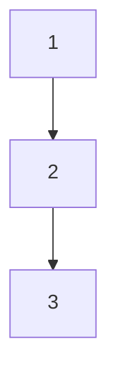
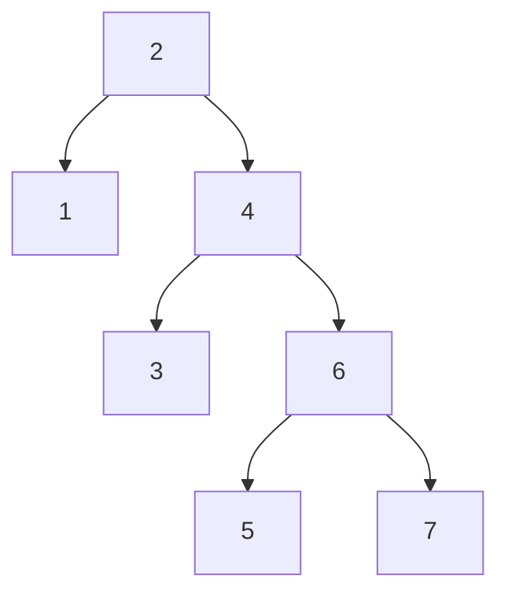

# Lowlevel

Reference:
- [Video](https://www.bilibili.com/video/BV1ge4y117cM)

### Optimization Direction
1. Transition between *Memory* and *Storage* is time consuming (Height of the Tree)
2. Time consuming of reading single and continuous elements are almost the same (B+ Tree)


## 1. Index (索引)
A `sorted` list of data that can be used to quickly find.

- Sorted Binary Tree
- Red-Black Tree
- B Tree & B+ Tree
- Hash Table （不支持连续查找）

---
#### Sorted Binary Tree
Left child < Parent < Right child

**Why not use it?**  
If every node has only one child, the tree will become a linked list. The time complexity of searching will be O(n) `(Node 3)`.



---
#### Red-Black Tree
Or Self-Balancing Binary Tree. A refined version of the sorted binary tree.

- The height of the tree is always O(logn).
- The tree is balanced, so the time complexity of searching is O(logn).

**Why not use it?**
- (Extreme case) The height of the tree trends to be high, searching a leaf node will take O(logn) time `(Node 5, 7)`.



---
#### B Tree & B+ Tree
Multi-way balanced search trees.

- Reduce tree height by storing more nodes in one leaf.
- Efficient for database indexing and file systems.


Update:


#### B+ Tree
Difference:
1. Only leaf nodes storage value (Address of target value)
2. Leaves are connected with each other, last leaf can quickly locate next leaf.

Why B+ then:
1. The Tree could be *Wider*
2. Enable range search (from x to y)


## Mysql Storage Engine 
| MyISAM | InnoDB |
| - | - |
| Old | New |
| Non-clustered | Clustered |


### Clustered & Non-clustered (聚集索引与非聚集索引)
**Non-clustered**: Data is non-continouly storaged (sparse).  （叶子结点存地址，需要取到地址时再查一次）

**Clustered**: Data and index are storaged together. （叶子结点包含了所有的信息）

| 特性	| 聚集索引 (Clustered Index) |	非聚集索引 (Non-clustered Index) |
| ----- | ----- | ----- |
|物理存储 |	数据本身按索引顺序物理存储 | 索引和数据分开存储
| 与数据的关系 | 索引即数据，数据即索引 |	索引是数据的“书签”或“目录” |
| 每表数量 | 最多 1 个 | 可以有多个 (例如，SQL Server中最多999个) |
| 叶子节点内容	| 完整的数据行 | 索引键值 + 指向数据行的指针
| 查找效率 |	范围查找和排序性能极高	| 单点查找性能高，但范围查找可能涉及多次回表 |
| 插入/更新开销 |	高。插入新数据可能导致页面分裂和数据移动。	| 较低。只需要维护索引结构，数据行本身位置不变。|
| 空间占用 |	索引本身不额外占用太多空间（因为它就是数据）|	需要额外的空间来存储索引结构 |

### 聚集索引

- 优点:
1. 范围查询极快：由于数据是物理连续的，查询一个范围内的数据（如 WHERE ID BETWEEN 100 AND 200）只需一次定位，然后顺序读取即可，I/O开销很小。
2. 访问速度快：因为索引的叶子节点就是数据，找到索引就找到了数据，无需二次查找（“回表”）。
- 缺点:
1. 插入/更新成本高：每次插入或更新聚集索引键的值，都可能需要移动大量数据来维持物理顺序，导致性能开销和页面碎片化。
2. 唯一性：一张表只能有一个，必须用在最关键、最频繁进行范围查找的列上。


### 非聚集索引
- 优点:
1. 查找速度快：能显著提升特定查询的 SELECT 性能。
插入/更新成本较低：插入数据时，数据行可以放在任何位置，只需更新索引结构即可，通常比聚集索引的开销小。
2. 灵活性高：可以为一张表创建多个非聚集索引，满足不同的查询需求。

- 缺点:
1. 需要“回表”：通过非聚集索引找到“指针”后，还需要根据指针再去数据页中查找完整的数据行。这个过程称为“回表”（Key Lookup），会增加一次I/O操作。
优化：如果查询所需的所有列都包含在非聚集索引中（即“覆盖索引”），则无需回表，性能会大幅提升。
占用额外空间：每个非聚集索引都是一个独立的结构，需要占用额外的磁盘空间。
2. 维护成本：对数据进行增删改时，所有相关的非聚集索引也都需要更新。
何时使用:

### Why clustered SQL engine

1. 索引即数据，减少磁盘IO
2. 优化范围查找
3. 支持二级索引
4. 支持事物


### 为什么使用自增主键而不是UUID
自增主键能够最大化B+树索引的插入性能和存储效率，而UUID则会引发灾难性的性能问题和空间浪费。

自增主键（顺序插入）：
  由于主键是连续递增的，新插入的数据行总是被添加到聚集索引B+树的最后一个数据页上。这是一种“追加”操作（Append-only），速度极快。当最后一个数据页写满时，InnoDB会平滑地分配一个新页继续写入。这种“页分裂”是良性的、顺序的，开销非常小。同样存储100万行数据，使用UUID的表会比使用自增ID的表占用多得多的磁盘空间。使用随机ID会导致页分裂使得存储效率降低。

一个方案：对内使用自增主键，对外使用UUID（额外列）

## 联合索引

联合索引（Composite Index），也叫复合索引，是指在数据库表的多个列上同时创建的一个索引。

简单来说，单列索引是只为一个字段建立索引，而联合索引则是将多个字段“联合”起来，作为一个整体建立索引。

例如，有一个用户表 users，包含 last_name (姓), first_name (名), 和 dob (出生日期) 三个字段。你可以创建一个联合索引，将这三个字段组合在一起：
```SQL
CREATE INDEX idx_lastname_firstname_dob ON users (last_name, first_name, dob);
```

### 核心规则：最左前缀原则（Leftmost Prefix Principle）
当使用联合索引时，查询条件必须从索引的最左边的列开始，并且不能跳过中间的列，这样索引才能被充分利用。

把联合索引 (col1, col2, col3) 想象成一本电话簿。电话簿是先按“姓氏”（col1）排序，在姓氏相同的情况下，再按“名字”（col2）排序，以此类推。

- 你要找“张三”：你先找到“张”姓的部分，再在其中找“三”。这个查询有效，因为你从最左边的“姓”开始用了。
- 你要找所有姓“张”的人：你也先找到“张”姓的部分。这个查询也有效。
- 你要找所有叫“三”的人：你无法直接利用这本电话簿，因为你不知道他的姓，只能一页一页地翻。这个查询无效

## SQL锁机制及优化
