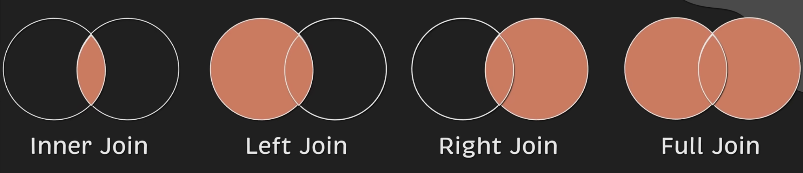

# 基础知识

## 连接



### 内连接（Inner Join）
| 只返回两个表中匹配的记录（默认连接方式）
1. 取出左表的所有记录
2. 取出右表中符合连接条件的记录
3. 结果集只包含两个表中符合连接条件的记录。

### 左连接（Left Join）
| 丰富左表中的数据，保留左表的所有记录
1. 取出左表的所有记录
2. 取出右表中符合连接条件的记录。如果右表中没有符合条件的记录，则结果中对应右表的字段为NULL。
3. 结果集包含左表的所有记录以及右表中符合条件的记录。

例子：
- 员工表与部门表进行左连接，返回所有员工及其对应的**部门名称**。如果某个员工没有对应的部门，则部门名称显示为NULL。
- 左表：Employees (员工)
- 右表：Departments (部门)
```sql
-- 下列出所有员工及其对应的部门名称
SELECT Employees.Name, Departments.DepartmentName
FROM Employees
LEFT JOIN Departments ON Employees.DepartmentID = Departments.ID;
```

### 右连接（Right Join）
左连接的反向操作，保留右表的所有记录。

一般在需要左连接后再进行右连接的场景下使用。

### 全连接（Full Join）
| 返回两个表中所有记录，匹配的记录合并在一起，不匹配的记录用NULL填充。

### 联合（Union）
| 将两个或多个SELECT语句的结果集合并为一个结果集，去除重复记录。
- 需要确保所有SELECT语句的列数和数据类型相同。
- 使用UNION ALL可以保留重复记录。

### 交叉连接（Cross Join）
| 返回两个表的笛卡尔积，即每个左表的记录与右表的每个记录组合在一起。
- 通常用于生成所有可能的组合。
- 结果集的行数等于左表行数乘以右表行数。
- 例子：有一个包含3个颜色的表和一个包含2个尺寸的表，使用交叉连接可以生成6种颜色和尺寸的组合。
```sql
SELECT Colors.Color, Sizes.Size
FROM Colors
CROSS JOIN Sizes;
```

### 自连接（Self Join）
| 将一个表与其自身进行连接，通常用于处理层次结构数据或比较同一表中的记录。
- 需要使用表别名来区分同一个表的不同实例。
- 例子：在员工表中查找每个员工的经理，可以使用自连接。
```sql
SELECT e1.Name AS Employee, e2.Name AS Manager
FROM Employees e1
LEFT JOIN Employees e2 ON e1.ManagerID = e2.ID;
```
