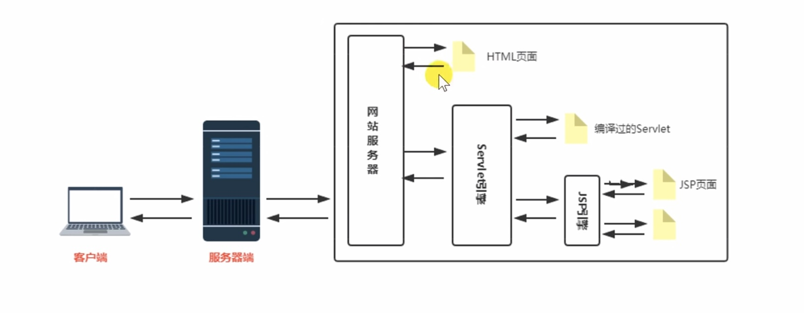
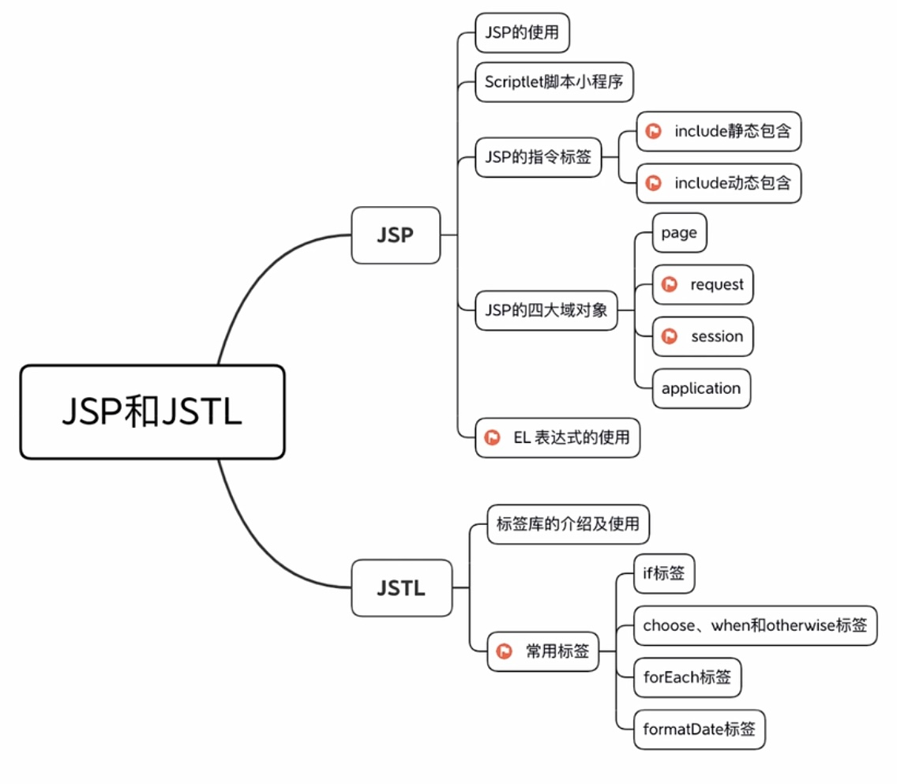

## JSP

最最最核心：JSP就是一个Servlet。

简单来说，JSP（JavaServer Pages）是一种用于创建动态网页的技术。它允许开发者将Java代码嵌入到HTML页面中，从而生成动态内容。



内容：


### Scriptlet

| 就是在JSP页面中嵌入Java代码的方式。Scriptlet代码块以<%开头，以%>结尾。（注意：Scriptlet已经不推荐使用，建议使用JSTL和EL表达式来替代。）

| 种类 | 作用 |
|---|---|
| <% Java代码 %> | 用于嵌入Java代码，可以包含变量声明、控制结构等。 |
| <%= 表达式 %> | 用于输出Java表达式的结果，等同于out.print(表达式)。 |
| <%! 成员声明 %> | 用于声明类成员变量和方法，这些成员在JSP转换后的Servlet类中可用。 |

### JSP项目结构
```txt
MyJSPProject/
├── WEB-INF/
│   ├── web.xml          # 部署描述符，配置JSP和Servlet
│   ├── classes/         # 编译后的Java类文件
│   └── lib/             # 依赖的JAR文件
├── index.jsp            # 主页JSP文件
|
```

### JSP文件

```jsp
<%@ page contentType="text/html;charset=UTF-8" language="java" %>
<html>
<head>
    <title>My JSP Page</title>
</head>
<body>
<%
    // Scriptlet: Java代码块
    String message = "Hello, JSP!";
%>
<h1><%= message %></h1> <!-- 输出Java表达式的结果 -->
</body>
</html>
```

### 指令标签：包含
1. 静态包含（Static Include） - 直接引入代码
```jsp
<%@ include file="header.jsp" %>
```
2. 动态包含（Dynamic Include）
```jsp
<jsp:include page="footer.jsp" />
```

### JSP四大域对象
1. page: 当前JSP页面对应的Servlet实例。
2. request: 表示客户端请求的信息，包含请求参数、头信息等。
3. session: 用于在多个请求之间存储用户会话数据。
4. application: 表示整个Web应用程序的上下文，所有用户共享的数据存储在这里。

### 简单例子
1. `/web/login.jsp`
```jsp
<form action="login" method="post">
    Username: <input type="text" name="username" />
    Password: <input type="password" name="password" />
    <input type="submit" value="Login" /> 
    <!-- 这个span默认为null（会输出出来） -->
    <span style="color:red;">{request.getAttribute("error")}</span>
</form>
```

2. `/src/com/example/LoginServlet.java`
```java
@WebServlet("/login")
public class LoginServlet extends HttpServlet {
    protected void doPost(HttpServletRequest request, HttpServletResponse response) throws ServletException, IOException {
        String username = request.getParameter("username");
        String password = request.getParameter("password");

        // check empty username and password
        if (username == null || password == null || username.isEmpty() || password.isEmpty()) {
            response.setAttribute("error", "Username and password cannot be empty.");
            // this is server side forward
            response.getRequestDispatcher("login.jsp").forward(request, response);
            return;
        }

        if ("admin".equals(username) && "password".equals(password)) {
            request.getSession().setAttribute("user", username);
            response.sendRedirect("welcome.jsp");
        } else {
            response.sendRedirect("login.jsp?error=1");
        }
    }
}
```

### EL表达式
EL（Expression Language）是一种简化JSP页面中数据访问的表达式语言。它允许开发者更方便地访问JavaBean属性、集合数据以及隐含对象。

刚刚的例子中：
```jsp
<span style="color:red;">${requestScope.error}</span>
```
可以直接，并且默认值为null时不输出，而不是显示一个null出来。
```jsp
<span style="color:red;">${error}</span>
```

设置数据：
```java
pageContext.setAttribute("uname", "pphui8");    // page范围
request.setAttribute("rname", "pphui9");         // request范围
session.setAttribute("sname", "pphui10");        // session范围
application.setAttribute("aname", "pphui11");    // application范围
```

访问数据：(默认从page->request->session->application查找)
```jsp
<p>Page Scope: ${pageScope.uname}</p>
<p>Request Scope: ${rname}</p>
<p>Session Scope: ${sessionScope.sname}</p>
<p>Application Scope: ${applicationScope.aname}</p>
```

empty判断：  
判断对象是否为空或者是null
```jsp
<c:if test="${empty rname}">
    <p>rname is empty</p>
</c:if>
```

### JSTL标签库
JSTL（JavaServer Pages Standard Tag Library）是JSP的标准标签库，提供了一组常用的标签，用于简化JSP页面中的逻辑处理和数据展示。

| 标签库 | 作用 |
|---|---|
| 核心标签库（core） | 提供基本的控制流标签，如条件判断、循环等。 |
| 格式化标签库（fmt） | 用于国际化和格式化日期、数字等。 |
| SQL标签库（sql） | 用于数据库操作，如查询和更新。 |
| XML标签库（xml） | 用于处理XML数据。 |

#### 引入JSTL标签库
在JSP页面中引入JSTL标签库：
```jsp
<%@ taglib uri="http://java.sun.com/jsp/jstl/core" prefix="c" %>
<%@ taglib uri="http://java.sun.com/jsp/jstl/fmt" prefix="fmt" %>
```

#### 核心标签库示例
1. 条件判断
```jsp
<c:if test="${user != null}">
    <p>Welcome, ${user}!</p>
</c:if>
```

2. 循环
```jsp  
<c:forEach var="item" items="${itemList}">
    <p>${item}</p>
</c:forEach>
```

3. 变量设置
```jsp
<c:set var="greeting" value="Hello, World!" />
<p>${greeting}</p>
```

4. switch
```jsp
<c:choose>
    <c:when test="${status == 'active'}">
        <p>Status is active.</p>
    </c:when>
    <c:when test="${status == 'inactive'}">
        <p>Status is inactive.</p>
    </c:when>
    <c:otherwise>
        <p>Status is unknown.</p>
    </c:otherwise>
</c:choose>
```

#### 格式化标签库示例
1. 日期格式化
```jsp
<fmt:formatDate value="${currentDate}" pattern="yyyy-MM-dd" />
```

2. 数字格式化
```jsp
<fmt:formatNumber value="${price}" type="currency" />
```

