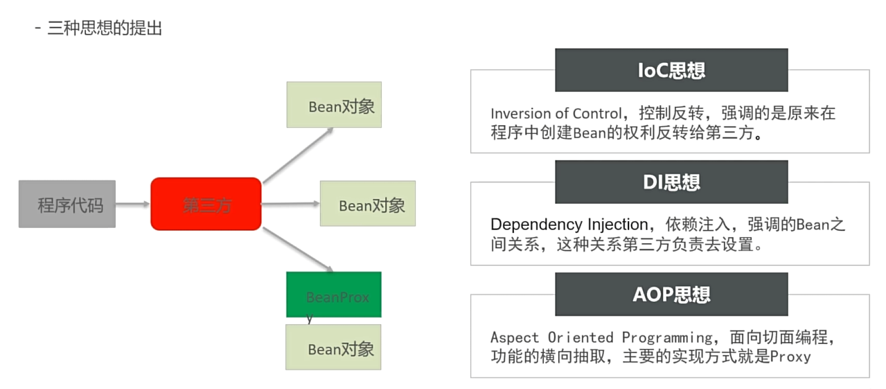

# JavaSpring

[bilibili1](https://www.bilibili.com/video/BV1WZ4y1P7Bp)  
[bilibili2](https://www.bilibili.com/video/BV1rt4y1u7q5)

## Why Spring?
- Problem of conventional Java EE
  - 层与层之间的耦合，接口与具体实现的耦合 (Factory模式)
  - 代码的重复 -> 自动new出携带模板功能的对象 (工厂模式)

## IOC, DI, AOP


- IOC (Inversion of Control) -> Bean的创建权限交给Spring容器
  - 控制反转，Spring容器负责创建对象
  - 通过配置文件或注解来定义对象的创建和依赖关系

- DI (Dependency Injection) -> 依赖注入
  - Spring容器负责将对象的依赖关系注入到对象中
  - 可以通过构造函数注入、Setter方法注入或字段注入

- AOP (Aspect-Oriented Programming) -> 面向切面编程
    - 通过切面来定义横切关注点
    - 可以在不修改业务代码的情况下添加日志、事务等功能

## Spring framework


### BeanFactory (core of Spring)
- BeanFactory是Spring的核心容器，负责管理Bean的生命周期和依赖关系


/resources/Bean.xml
```XML
    <bean id="userService" class="com.pphui8.spring.service.impl.UserServiceImpl">
<!--        here ref correspond to id="userDao"       -->
        <property name="userDao" ref="userDao"/>
    </bean>
    <bean id="userDao" class="com.pphui8.spring.dao.impl.UserDaoImp" />
```

/test/BeanFactoryTest.java
```Java
public class BeanFactoryTest {
    public static void main(String[] args) {
        // 创建工厂对象
        DefaultListableBeanFactory beanFactory = new DefaultListableBeanFactory();
        // 创建xml读取器
        XmlBeanDefinitionReader reader = new XmlBeanDefinitionReader(beanFactory);
        // 读取器绑定工厂
        reader.loadBeanDefinitions(new ClassPathResource("Bean.xml"));
        // 根据id获取Bean实例对象
        // 这里的id对应Bean.xml中的id属性
        UserService userService = (UserService) beanFactory.getBean("userService");

        UserDao userDao = (UserDao) beanFactory.getBean("userDao");

//        System.out.println(userService);
//        System.out.println(userDao);
    }
}
```

/userDao/impl/UserDaoImpl.java
```Java
public class UserServiceImpl implements UserService {
    // BeanFactory调用该方法从容器中获得userDao设置到此处
    public void setUserDao(UserDao userDao) {
        System.out.println("setUserDao has been called " + userDao);
    }
}
```

### ApplicationContext
- ApplicationContext是BeanFactory的子接口，提供了更多的功能，如国际化、事件传播等


```Java
public class ApplicationContextTest {
    public static void main(String[] args) {
//        ApplicationContext context = new ClassPathXmlApplicationContext("applicationContext.xml");
        ApplicationContext context = new ClassPathXmlApplicationContext("Bean.xml");
        UserService userService = (UserService) context.getBean("userService");
        System.out.println(userService);
    }
}
```

### ApplicationContext 继承体系
Spring基础环境下常用的ApplicationContext：
| 实现类 | 描述 |
| --- | --- |
| ClassPathXmlApplicationContext | 从类路径加载配置文件 |
| FileSystemXmlApplicationContext | 从文件系统加载配置文件 |
| AnnotationConfigApplicationContext | 从注解配置类加载配置 |

---

## 基于xml的Spring应用

### SpringBean的配置详解

|Xml元素|描述|
| --- | --- |
| `<bean id="..." class="...">` | 定义一个Bean，id是Bean的唯一标识，class是Bean的实现类 |
| `<bean name="...">` | 定义一个Bean，name可以是多个名称的组合，用逗号分隔。（BeanFactory.getBean("name")使用） |
| `<bean scope="...">` | 定义Bean的作用域，常用的有singleton（单例）和prototype（多例） |`
| `<bean lazy-init="true">` | 定义Bean的懒加载，只有在第一次使用时才创建 |
| `<bean init-method="...">` | 定义Bean的初始化方法，在Bean创建后调用 |
| `<bean destroy-method="...">` | 定义Bean的销毁方法，在容器关闭时调用 |
| `<bean autowire="...">` | 定义Bean的自动装配（注入）方式，常用的有no（不自动装配）、byName（按名称装配）、byType（按类型装配）和constructor（构造器装配） |
| `<bean factory-bean="..." factory-method="...">` | 定义一个工厂Bean，factory-bean是工厂Bean的id，factory-method是工厂方法的名称 |


#### Bean的作用域
| 作用域 | 描述 |
| --- | --- |
| singleton | 单例模式，整个Spring容器中只有一个Bean实例 (默认) |
| prototype | 多例模式，容器初始化时不会创建Bean实例，每次获取Bean都会创建一个新的实例 |

#### Bean初始化，销毁方法
```Java
public class UserServiceImpl implements UserService {
    public void init() {}
//  销毁方法, 需要显示调用 applicationContext.close() 或者在容器关闭时自动调用
    public void destroy() {}
}
```

```XML
<bean id="userService" class="com.pphui8.spring.service.impl.UserServiceImpl"
      init-method="init" destroy-method="destroy">
    <property name="userDao" ref="userDao"/>
</bean>
```

| 拓展：InitializingBean, DisposableBean 接口
```Java
public class UserServiceImpl implements UserService, InitializingBean, DisposableBean {
    @Override
    public void afterPropertiesSet() throws Exception {
        // 初始化方法
    }

    @Override
    public void destroy() throws Exception {
        // 销毁方法
    }
}
```

#### Bean的实例化配置
| 配置方式 | 描述 |
| --- | --- |
| 构造方式实例化 | 使用`<constructor-arg>`标签指定构造函数参数 |
| 静态工厂方法实例化 | 使用`factory-method`属性指定**静态**工厂方法 |
| 实例工厂方法实例化 | 使用`factory-bean`和`factory-method`属性指定**实例**工厂方法 |
| 实现FactoryBean接口 | 通过实现`FactoryBean`接口来创建Bean（底层实现，不常用） |

1. 构造方式实例化
```XML
<bean id="userService" class="com.pphui8.spring.service.impl.UserServiceImpl">
    <constructor-arg value="John Doe"/>
    <constructor-arg ref="userDao"/>
</bean>
```
```Java
public class UserServiceImpl implements UserService {
    private String name;
    private UserDao userDao;

    public UserServiceImpl(String name, UserDao userDao) {
        this.name = name;
        this.userDao = userDao;
    }

    // 其他方法...
}
```

2. 静态工厂方法实例化
```XML
<bean id="userService" class="com.pphui8.spring.service.impl.UserServiceFactory"
      factory-method="createUserService"/>
```
```Java
public class UserServiceFactory {
    public static UserService createUserService() {
        return new UserServiceImpl();
    }
}
```

3. 实例工厂方法实例化

| 这种方式创建的Bean需要先创建工厂Bean，然后通过工厂Bean来创建目标Bean（第三方库或复杂对象）
```XML
<!-- 先创建工厂对象实例 -->
<bean id="userServiceFactory" class="com.pphui8.spring.service.impl.UserServiceFactory"/>
<!-- 再通过工厂对象创建目标Bean -->
<bean id="userService" factory-bean="userServiceFactory" factory-method="createUserService"/>
```
```Java
public class UserServiceFactory {
    public UserService createUserService() {
        return new UserServiceImpl();
    }
}
```

4. 实现FactoryBean接口
```XML
<bean id="userService" class="com.pphui8.spring.service.impl.UserServiceFactoryBean"/>
```
```Java
public class UserServiceFactoryBean implements FactoryBean<UserService> {
    @Override
    public UserService getObject() throws Exception {
        return new UserServiceImpl();
    }

    @Override
    public Class<?> getObjectType() {
        return UserService.class;
    }

    @Override
    public boolean isSingleton() {
        return true; // 是否单例
    }
}
```

#### Bean的依赖注入
| 依赖注入方式 | 描述 | 代码 |
| --- | --- | --- |
| 构造器注入 | 通过构造函数传入依赖对象 | `<constructor-arg ref="userDao"/>` <br/> `<constructor-arg value="John Doe"/>` |
| Setter方法注入 | 通过Setter方法设置依赖对象 | `<property name="userDao" ref="userDao"/>` <br/> `<property name="name" value="John Doe"/>` |

1. 拓展：注入集合类型
```XML
<bean id="userService" class="com.pphui8.spring.service.impl.UserServiceImpl">
    <property name="userDaoList">
        <list>
            <ref bean="userDao1"/>
            <ref bean="userDao2"/>
        </list>
    </property>
    <property name="userDaoMap">
        <map>
            <entry key="userDao1" value-ref="userDao1"/>
            <entry key="userDao2" value-ref="userDao2"/>
        </map>
    </property>
    <property name="userDaoSet">
        <set>
            <ref bean="userDao1"/>
            <ref bean="userDao2"/>
        </set>
    </property>
    <property name="userDaoProperties">
        <props>
            <prop key="username">John Doe</prop>
            <prop key="password">123456</prop>
        </props>
    </property>
</bean>
```
```Java
public class UserServiceImpl implements UserService {
    private List<UserDao> userDaoList;
    private Map<String, UserDao> userDaoMap;
    private Set<UserDao> userDaoSet;

    public void setUserDaoList(List<UserDao> userDaoList) {
        this.userDaoList = userDaoList;
    }

    public void setUserDaoMap(Map<String, UserDao> userDaoMap) {
        this.userDaoMap = userDaoMap;
    }

    public void setUserDaoSet(Set<UserDao> userDaoSet) {
        this.userDaoSet = userDaoSet;
    }

    public void setUserDaoProperties(Properties userDaoProperties) {
        // 处理Properties类型的依赖注入
        for (String key : userDaoProperties.stringPropertyNames()) {
            System.out.println("Key: " + key + ", Value: " + userDaoProperties.getProperty(key));
        }
    }
}
```

#### 自动装配

| 自动装配方式 | 描述 | 细节 |
| --- | --- | --- |
| no | 不自动装配 | `<bean id="userService" class="com.pphui8.spring.service.impl.UserServiceImpl" autowire="no"/>` |
| byName | 按名称自动装配 | 代码自动匹配setXxx方法的参数名与Bean的id |
| byType | 按类型自动装配 | 代码自动匹配Bean的类型，当有多个匹配时会抛出异常 |


1. byName自动装配 （这个例子中恰好byType也可以）
```XML
<bean id="userService" class="com.pphui8.spring.service.impl.UserServiceImpl" autowire="byType">
    <property name="userDao" ref="userDao"/>
    <property name="name" value="John Doe"/>
</bean>
<bean id="userDao" class="com.pphui8.spring.dao.impl.UserDaoImpl"/>
```

```Java
public class UserServiceImpl implements UserService {
    private UserDao userDao;
    private String name;

    // Setter方法
    public void setUserDao(UserDao userDao) {
        this.userDao = userDao;
    }

    public void setName(String name) {
        this.name = name;
    }

    // 其他方法...
}
```

#### Spring的标签
| 标签 | 描述 |
| --- | --- |
| 默认标签 | 不用要配置任何内容，Spring会自动处理 |
| 自定义标签 | 可以引入自定义标签库，使用自定义标签来简化配置 |

| 默认标签 | 描述 |
| --- | --- |
| `<beans>` | 根标签，表示这是一个Spring配置文件 |
| `<bean>` | 定义一个Bean，包含id、class等属性 |
| `<import>` | 引入其他配置文件 |
| `<alias>` | 定义Bean的别名 |

```XML
<beans xmlns="http://www.springframework.org/schema/beans"
       xmlns:xsi="http://www.w3.org/2001/XMLSchema-instance"
       xmlns:context="http://www.springframework.org/schema/context"
       xsi:schemaLocation="http://www.springframework.org/schema/beans
                           http://www.springframework.org/schema/beans/spring-beans.xsd
                           http://www.springframework.org/schema/context
                           http://www.springframework.org/schema/context/spring-context.xsd">

    <context:component-scan base-package="com.pphui8.spring"/>
    <bean id="userService" class="com.pphui8.spring.service.impl.UserServiceImpl">
        <property name="userDao" ref="userDao"/>
    </bean>
</beans>
```

1. 使用 `<beans>` 区分环境
```XML
<bean>
    <property name="name" value="John Doe"/>
    <property name="age" value="30"/>
</bean>

<beans profile="dev">
    ...
</beans>
<beans profile="prod">
    ...
</beans>
```

激活环境
```Java
System.setProperty("spring.profiles.active", "dev");
ApplicationContext context = new ClassPathXmlApplicationContext("applicationContext.xml");
``` 

2. 使用 `<import>` 引入其他配置文件
```XML
<import resource="classpath:applicationContext-dao.xml"/>
<import resource="classpath:applicationContext-service.xml"/>
```

3. 使用 `<alias>` 定义Bean的别名
```XML
<alias name="userService" alias="userServiceAlias"/>
```

2. 自定义标签 (以spring的context和mvc为例)
```XML
<beans xmlns="http://www.springframework.org/schema/beans"
       xmlns:xsi="http://www.w3.org/2001/XMLSchema-instance"
       xmlns:context="http://www.springframework.org/schema/context"
       xmlns:mvc="http://www.springframework.org/schema/mvc"
       ...

    <mvc:annotation-driven/>
    <mvc:default-servlet-handler/>
</beans>
```