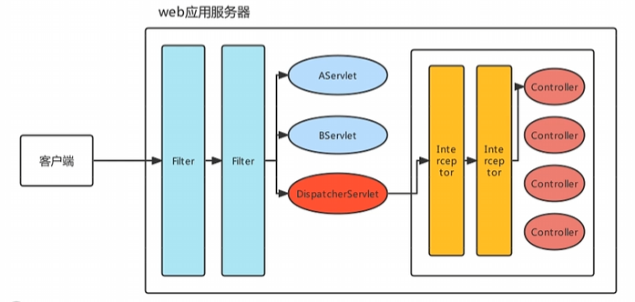
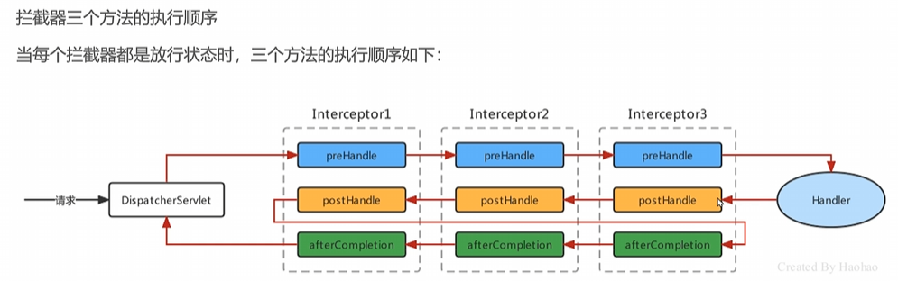

### 拦截器 Interceptor




拦截器是Spring MVC中的一个重要组件，用于在请求处理之前或之后执行一些通用的操作，如日志记录、权限检查等。拦截器可以对请求进行预处理和后处理。


| 技术 | Fliter | Interceptor |
|--- | --- | --- |
| 作用范围 | Servlet级别 | Spring MVC级别 |
| 执行顺序 | 在Servlet之前 | 晚于DispatcherServlet |
| 处理请求 | 处理请求和响应 | 只对进入Spring MVC的请求进行处理 |

### 定义拦截器
```java
@Component
public class MyInterceptor implements HandlerInterceptor {
    @Override
    public boolean preHandle(HttpServletRequest request, HttpServletResponse response, Object handler) throws Exception {
        // 在请求处理之前执行
        System.out.println("Pre Handle: " + request.getRequestURI());
        return true; // 返回true表示继续处理请求，返回false表示阻止请求继续处理
    }

    @Override
    public void postHandle(HttpServletRequest request, HttpServletResponse response, Object handler, ModelAndView modelAndView) throws Exception {
        // 在请求处理之后执行
        System.out.println("Post Handle: " + request.getRequestURI());
    }

    @Override
    public void afterCompletion(HttpServletRequest request, HttpServletResponse response, Object handler, Exception ex) throws Exception {
        // 在视图渲染完成后执行
        System.out.println("After Completion: " + request.getRequestURI());
    }
}
```

### 注册拦截器


```java
@Configuration
public class WebConfig implements WebMvcConfigurer {
    @Override
    public void addInterceptors(InterceptorRegistry registry) {
        registry.addInterceptor(new MyInterceptor())
                .addPathPatterns("/**") // 拦截所有请求
                .excludePathPatterns("/login", "/static/**"); // 排除特定路径
    }
}
```

### 全注解开发
```Java
@Configuration
@ComponentScan(basePackages = "com.example") // 扫描组件

// <mvc:annotation-driven />
@EnableWebMvc 
public class WebConfig implements WebMvcConfigurer {
    @Bean
    public CommonMultipartResolver multipartResolver() {
        return new CommonsMultipartResolver(); // 配置文件上传解析器
    }

}
```
```Java
public class MyAnnotationConfigWebApplicationContext extends AnnotationConfigWebApplicationContext {
    public MyAnnotationConfigWebApplicationContext() {
        super();
        setServletContext(new MockServletContext());
        register(WebConfig.class); // 注册配置类
    }
}
```

### 组件原理
1. 前端控制器
前端控制器是Spring MVC的核心组件，它负责接收所有的HTTP请求，并将请求分发到相应的处理器（Controller）进行处理。
    1. 获得ApplicationContext容器
    2. 注册SpringMVC的9大组件

继承顺序:
DispatcherServlet -> FrameworkServlet -> HttpServletBean

执行流程：
1. 前端控制器接收到请求
2. 前端控制器根据请求的URL查找对应的处理器（Handler）
3. 前端控制器调用处理器的`@RequestMapping`方法进行处理
4. 处理器返回处理结果
5. 前端控制器将处理结果转换为视图（View）
6. 前端控制器将视图渲染到客户端

### 异常处理
异常处理是Spring MVC中的一个重要功能，用于处理在请求处理过程中发生的异常。可以通过全局异常处理器或局部异常处理器来处理异常。

| 接口或类 | 描述 |
| --- | --- |
| `HandlerExceptionResolver` | 用于处理异常的接口，可以自定义异常处理逻辑 |
| `@ExceptionHandler` | 用于在控制器方法中处理特定异常的注解 |
| `HandlerExceptionResolver` | Spring MVC提供的异常处理器接口 |
| `HandlerExceptionResolverComposite` | 组合多个异常处理器的类 |
| `SimpleMappingExceptionResolver` | 简单的异常映射处理器，将异常映射到视图 |
| `ExceptionHandlerExceptionResolver` | 基于`@ExceptionHandler`注解的异常处理器 |
| `DefaultHandlerExceptionResolver` | 默认的异常处理器，处理Spring MVC的常见异常 |
| `ResponseStatusExceptionResolver` | 基于HTTP状态码的异常处理器 |

```Java
@Configuration
@EnableWebMvc
public class SpringMvcConfig {
    @Bean
    public SimpleMappingExceptionResolver simpleMappingExceptionResolver() {
        SimpleMappingExceptionResolver resolver = new SimpleMappingExceptionResolver();
        Properties properties = new Properties();
        properties.setProperty("java.lang.Exception", "error"); // 映射异常到视图
        resolver.setExceptionMappings(properties);
        return resolver;
    }
}
```

```Java
@Component
public class MyExceptionResolver implements HandlerExceptionResolver {
    @Override
    public ModelAndView resolveException(HttpServletRequest request, HttpServletResponse response, Object handler, Exception ex) {
        ModelAndView modelAndView = new ModelAndView("error"); // 返回错误视图
        modelAndView.addObject("message", ex.getMessage());
        return modelAndView;
    }
}


