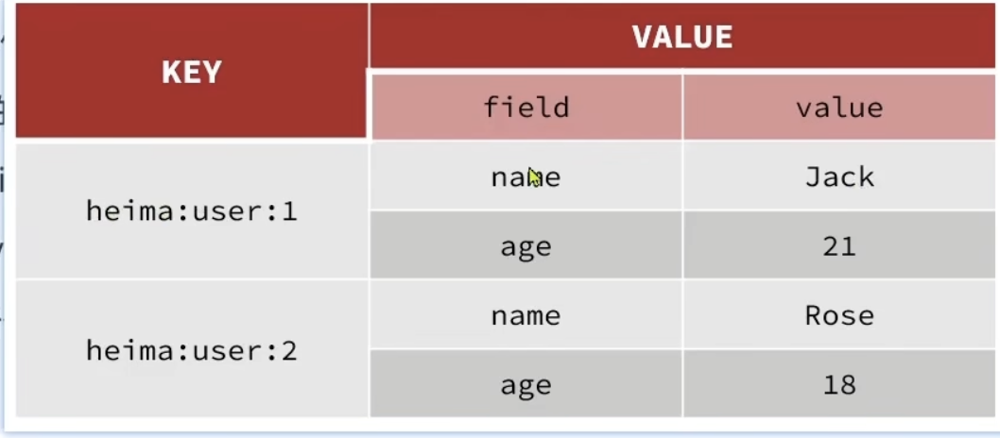

# Redis

| | SQL | NoSQL |
|---|-----|------|
| Data Structure | Structured | Key-Value, Document, Graph, Column-Family |
| Data Relationship | Relationships between tables | Relationships between keys |
| Query Language | SQL | NoSQL Query Language |
| Transactions | ACID | BASE |
| Scalability | Vertical Scaling | Horizontal Scaling |
| Storage | Disk-based | In-memory |


Key of Redis:
- Key-Value storage
- Single-threaded event loop, every command is executed sequentially
- Data is stored in memory, making it extremely fast
- Supports long-term storage with persistence options （防止断电就丢失数据）
- Supports replication and clustering for high availability and scalability

Appplications of Redis:
- Caching (e.g., session storage, page caching)
- Real-time analytics (e.g., counting, ranking)
- Pub/Sub messaging (e.g., chat applications, notifications)
- Phone number verification (e.g., OTP storage)

## Redis Commands
### Data Types
- String (also commonly used for `key`)
- Hast
- List
- Set
- Sorted Set
- GEO (Geospatial data)
- Bitmaps

### Basic Commands
- `SET key value` - Set the value of a key
- `GET key` - Get the value of a key
- `DEL key` - Delete a key
- `EXISTS key` - Check if a key exists
- `EXPIRE key seconds` - Set a timeout on a key
- `TTL key` - Get the time to live of a key
- `FLUSHDB` - Delete all keys in the current database
- `FLUSHALL` - Delete all keys in all databases

1. Key in Redis can be layered by using colons, e.g., `ppstore:user:1`, `ppstore:product:1`.
2. 

### Advanced Commands
1. **String Commands**
   - `APPEND key value` - Append a value to a key
   - `INCR key` - Increment the integer value of a key by one
   - `DECR key` - Decrement the integer value of a key by one
   - `GETSET key value` - Set the value of a key and return its old value
   - `MGET key1 key2 ...` - Get the values of multiple keys
   - `MSET key1 value1 key2 value2 ...` - Set multiple keys to multiple values
   - `SETNX key value` - Set the value of a key only if it does not already exist
   - `STRLEN key` - Get the length of the value stored in a key

2. **Hash Commands**
   - `HSET key field value` - Set the value of a field in a hash
   - `HGET key field` - Get the value of a field in a hash
   - `HDEL key field` - Delete a field from a hash
   - `HGETALL key` - Get all fields and values in a hash

Hash is a collection of key-value pairs, similar to a dictionary in Python or an object in JavaScript. It is useful for storing objects with multiple attributes.


3. **List Commands** (A Linked List like Data Structure)
    - `LPUSH key value` - Prepend a value to a list
    - `RPUSH key value` - Append a value to a list
    - `LPOP key` - Remove and return the first element of a list
    - `RPOP key` - Remove and return the last element of a list
    - `LRANGE key start stop` - Get a range of elements from a list

    A `List` is:
    1. Ordered
    2. Can contain duplicate values
    3. Can be used as a queue (FIFO) or stack (LIFO)
    4. Supports operations like push, pop, and range queries

4. **Set Commands** (A Hashmao based Data Structure)
   - `SADD key member` - Add a member to a set
   - `SREM key member` - Remove a member from a set
   - `SMEMBERS key` - Get all members of a set
   - `SISMEMBER key member` - Check if a member is in a set

   A `Set` is:
    1. Unordered
    2. Cannot contain duplicate values
    3. Useful for operations like union, intersection, and difference


5. **Sorted Set Commands**
    - `ZADD key score member` - Add a member with a score to a sorted set
    - `ZREM key member` - Remove a member from a sorted set
    - `ZRANGE key start stop` - Get a range of members from a sorted set by index
    - `ZRANGEBYSCORE key min max` - Get members in a sorted set within a score range
    - `ZCARD key` - Get the number of members in a sorted set
    - `ZRANK key member` - Get the rank of a member in a sorted set (0-based index)
    - `ZCARD key` - Get the number of members in a sorted set


### Java Adapter for Redis
1. setup Redis connection
```java
private Jedis = jedis;

@BeforeEach
public void setUp() {
    jedis = new Jedis("localhost", 6379);
    jedis.auth("your_password"); // if Redis is password protected
    jedis.select(0); // select database 0
}
```
2. Data Operations
```java
// String Operations
@Test
public void testStringOperations() {
    jedis.set("key1", "value1");
    String value = jedis.get("key1");
    assertEquals("value1", value);
}
```
3. Close Connection
```java
@AfterEach
public void tearDown() {
    if (jedis != null) {
        jedis.close();
    }
}
```

https://www.bilibili.com/video/BV1cr4y1671t?spm_id_from=333.788.videopod.episodes&vd_source=cad68d53a48573461e83be27a70101d1&p=18