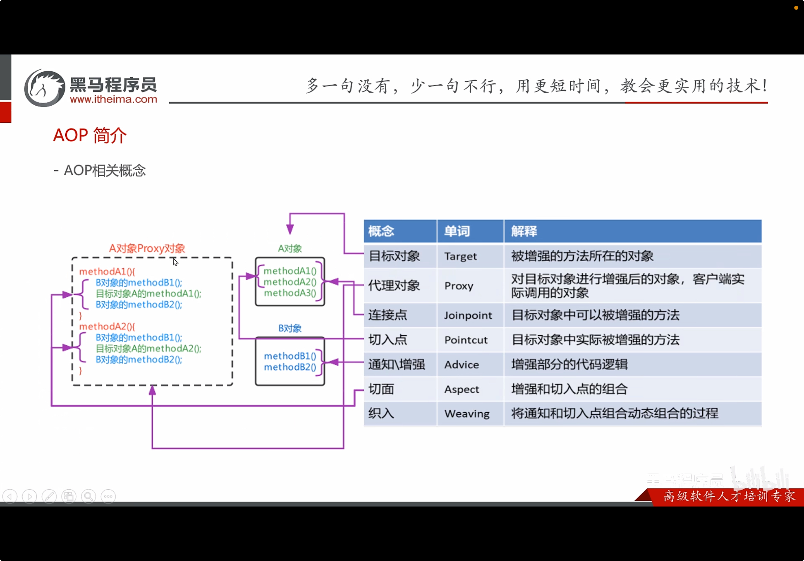

## SpringAOP
JavaAOP （Aspect Oriented Programming）是面向切面编程的缩写，是一种编程范式，它通过将关注点分离来提高代码的模块化。Spring AOP 是 Spring 框架的一部分，提供了对 AOP 的支持。

OOP是纵向对一个事物的抽象，一个对象的属性和方法。AOP是横向对一个事物的抽象，多个对象的公共行为。

实现：Proxy（代理）模式，增强Java方法的功能。(动态代理)

### AOP思想的实现
```Java
// A obj
public class A {
    method1();
    method2();
    method3();
}

// B obj
public class B {
    method1();
    method2();
}

// enhaved A with B`s methods
public class ProxyA {
    Obj_B_method1()
    Obj_A_method1()
    Obj_B_method2()
}
public class ProxyB {
    Obj_A_method1()
    Obj_B_method2()
    Obj_A_method2()
}
```

### 具体实现
1. 使用BeanPostProcessor接口实现Bean的后处理器。
2. 在BeanPostProcessor的postProcessAfterInitialization方法中，对需要增强的Bean进行代理。
3. 使用ApplicationContextAware接口获取ApplicationContext，以便获取Advice对象。
4. 在UserServiceImpl中直接注入Advice对象，并在Invoke前后执行Advice的方法。

```Java
public class MockAOPBeanPostProcessor implements BeanPostProcessor, ApplicationContextAware {
    private ApplicationContext applicationContext;

    @Override
    public Object postProcessAfterInitialization(Object bean, String beanName) throws BeansException {
        // 对UserService中的show1和show2方法，使用Advice中的beforeAdvice和afterAdvice进行增强
        // 对userService中的所有对象进行增强
        if(bean instanceof UserServiceImpl) {
            // 执行增强对象的before方法
            // 执行增强对象的方法
            return Proxy.newProxyInstance(
                    bean.getClass().getClassLoader(),
                    bean.getClass().getInterfaces(),
                    (proxy, method, args) -> {
                        // 执行增强对象的before方法
                        Advice myAdvice = applicationContext.getBean(Advice.class);
                        myAdvice.beforeAdvice();
                        // 执行增强对象的方法
                        Object result = method.invoke(bean, args);
                        // 执行
                        myAdvice.afterAdvice();
                        return result;
                    }
            );
        }
        // 如果无需增强
        return bean;
    }

    @Override
    public void setApplicationContext(ApplicationContext applicationContext) throws BeansException {
        this.applicationContext = applicationContext;
    }
}
```

### Spring AOP的实现
Spring AOP 使用动态代理来实现切面编程。它可以在运行时创建一个代理对象，该对象可以拦截方法调用并在调用前后执行额外的逻辑。

| 概念 | 关键字 | 描述 |
| ---- | ------ | ---- |
| 目标对象 | target | 被代理的对象，通常是一个业务类 |
| 代理对象 | proxy | 代理目标对象的对象，拦截方法调用并执行额外逻辑 |
| 连接点 | join point | 程序执行的某个点，例如方法调用 |
| 切点 | pointcut | 定义在哪些连接点上应用切面，通常是方法执行 |
| 通知 | advice | 在切点处执行的代码，分为前置通知、后置通知、异常通知等 |
| 切面 | aspect | 由切点和通知组成的模块，定义了在哪些连接点上应用哪些通知 |
| 引入 | introduction | 向目标对象添加新的方法或属性 |
| 织入 | weaving | 将切面应用到目标对象的过程，可以在编译时、类加载时或运行时进行 |




### XML配置AOP
1. 导入APO相关坐标
2. 准备目标类，增强类，并配置给Spring管理
3. 配置切点表达式（哪些方法被增强）
4. 配置织入（哪些方法增强了哪些方法）
```xml
<xml version="1.0" encoding="UTF-8"?>
<beans xmlns="http://www.springframework.org/schema/beans"
       xmlns:xsi="http://www.w3.org/2001/XMLSchema-instance"
       xmlns:aop="http://www.springframework.org/schema/aop"
       xsi:schemaLocation="
           http://www.springframework.org/schema/beans
           http://www.springframework.org/schema/beans/spring-beans.xsd
           http://www.springframework.org/schema/aop
           http://www.springframework.org/schema/aop/spring-aop.xsd">

    <bean id="myAspect" class="com.example.MyAspect"/>

    <aop:config>
        <aop:aspect ref="myAspect">
        <!-- 指定哪些方法被增强 -->
            <aop:pointcut id="myPointcut" expression="execution(* com.example.service.*.*(..))"/>
        <!-- 配置织入 -->
            <aop:pointcut ref="myAdvice">
                <aop:before method="beforeAdvice" pointcut-ref="myPointcut"/>
                <aop:after method="afterAdvice" pointcut-ref="myPointcut"/>
            </aop:pointcut>
        </aop:aspect>
    </aop:config>
```


#### 切点表达式
```txt
execution(【访问修饰符】返回值类型 报名.类名.方法】(参数))
```

其中
1. 访问修饰符：可选，指定方法的访问权限（public、protected、private等）。
2. 返回值类型：指定方法的返回类型，可以是具体类型或通配符（*）。
3. 包名.类名.方法：指定方法所在的包和类，可以使用通配符（*）匹配多个包或类。
4. 包名和类名之间可以使用点（.）分隔，(..) 表示当前包及其子包。
5. 参数：指定方法的参数类型，可以使用通配符（..）匹配任意数量的参数。

Demo:
```Java
execution(public void com.example.service.UserService.show(..))
execution(* com.example.service.UserService.*(..))
// 匹配UserService包下的所有方法
execution(* com.example.service.*.*(..))
// 匹配com.example.service包及其子包下的所有方法
execution(* com.example.service..*.*(..))
```

### 通知类型
| 通知类型 | 配置方式 | 描述 |
| -------- | -------- | ---- |
| 前置通知 | `<aop:before>` | 在方法执行前执行 |
| 后置通知 | `<aop:after-returning>` | 在方法执行后执行 |
| 异常通知 | `<aop:after-throwing>` | 在方法抛出异常时执行 |
| 环绕通知 | `<aop:around>` | 在方法执行前后执行，可以控制方法是否执行 |
| 最终通知 | `<aop:after>` | 在方法执行后执行，无论是否抛出异常 |

### 两种配置方式
1. `advisor` 配置切面
2. `aspect` 配置切面
spring实现了一个Advice接口，实现了这个接口的类可以作为切面中的通知。


## 89