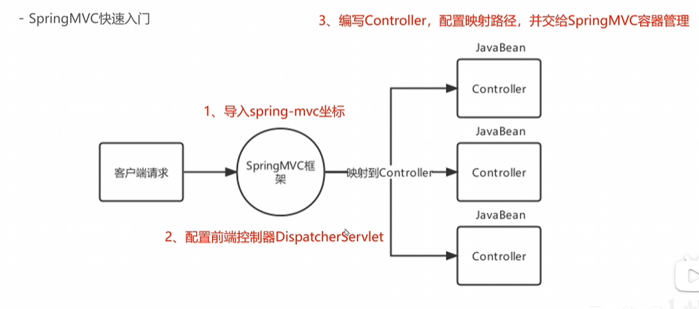

## SpringMVC

客户端请求 -> SpringMVC -> 自动映射 -> Controller -> Service -> Dao -> 数据库





### SpringMVC的工作流程
1. 客户端发送请求到DispatcherServlet
2. DispatcherServlet接收请求，调用HandlerMapping获取处理器（Controller）
3. DispatcherServlet调用HandlerAdapter执行处理器
4. HandlerAdapter调用Controller的处理方法
5. Controller处理请求，调用Service层
6. Service层调用Dao层
7. Dao层访问数据库，获取数据
8. Dao层返回数据到Service层
9. Service层返回数据到Controller
10. Controller将数据封装到ModelAndView对象中
11. Controller返回ModelAndView对象到HandlerAdapter
12. HandlerAdapter将ModelAndView对象返回到DispatcherServlet
13. DispatcherServlet根据视图解析器解析视图
14. DispatcherServlet将视图渲染到客户端

### 关键组件


| 组件 | 描述 | 常用组件 |
| ---- | ---- | ----- |
| HandlerMapping | 处理器映射器，负责将请求映射到具体的处理器（Controller） | RequestMappingHandlerMapping |
| HandlerAdapter | 处理器适配器，负责调用具体的处理器方法 | RequestMappingHandlerAdapter |
| ViewResolver | 视图解析器，负责将逻辑视图名解析为具体的视图实现 | InternalResourceViewResolver |


### 请求路径配置
| 注解 | 描述 |
| ---- | ---- |
| @RequestMapping | 映射请求路径到处理器方法或类 |
| @GetMapping | 映射GET请求到处理器方法 |
| @PostMapping | 映射POST请求到处理器方法 |

```Java
@Controller
public class UserController {

    @RequestMapping("/user")
    public String getUser(Model model) {
        // 处理请求，获取用户数据
        User user = userService.getUser();
        model.addAttribute("user", user);
        return "userView"; // 返回逻辑视图名
    }

    @GetMapping("/user/{id}")
    public String getUserById(@PathVariable("id") Long id, Model model) {
        User user = userService.getUserById(id);
        model.addAttribute("user", user);
        return "userView";
    }
}
```

### 数据绑定
```Java
@Controller
public class UserController {
    @GetMapping("/user")
    public String getUserForm(@requestParam("name") String name,
                            @RequestParam("age") int age,
                            Model model) {
        User user = new User();
        user.setName(name);
        user.setAge(age);
        model.addAttribute("user", user);
        return "userForm"; // 返回逻辑视图名
    }
    @GetMapping("/keyvalue")
    public String handleKeyValue(@RequestParam Map<String, String> keyValueMap, Model model) {
        // 处理键值对数据
        model.addAttribute("keyValueMap", keyValueMap);
        return "keyValueView"; // 返回逻辑视图名
    }
    @GetMapping("/autoBind")
    public String autoBind(@ModelAttribute User user, Model model) {
        // 自动绑定请求参数到User对象
        model.addAttribute("user", user);
        return "userView"; // 返回逻辑视图名
    }
}
```

```Java
@Controller
public class UserController {
    @PostMapping("/user")
    // 带自动转换的@RequestBody
    public String createUser(@RequestBody User user, Model model) {
        // String to Json
        ObjectMapper objectMapper = new ObjectMapper();
        User user = objectMapper.readValue(userJson, User.class);
        model.addAttribute("user", user);
        return "userView"; // 返回逻辑视图名
    }
}
```

### 文件上传
```XML
<!-- 配置文件上传解析器 -->
<bean id="multipartResolver" class="org.springframework.web.multipart.commons.CommonsMultipartResolver">
    <property name="maxUploadSize" value="10485760"/> <!-- 最大上传文件大小 -->
    <property name="defaultEncoding" value="UTF-8"/> <!-- 编码 -->
    <property name="resolveLazily" value="true"/> <!-- 延迟解析 -->
    <property name="uploadTempDir" value="/tmp"/> <!-- 临时目录 -->
    <property name="maxInMemorySize" value="4096"/> <!-- 内存中最大文件大小 -->
    <property name="fileItemFactory" ref="fileItemFactory"/> <!-- 文件项工厂 -->
</bean>
```
```Java
@Controller
public class FileUploadController {
    @PostMapping("/upload")
    public String handleFileUpload(@RequestParam("file") MultipartFile file, Model model) {
        if (!file.isEmpty()) {
            try {
                // 保存文件到服务器
                String fileName = file.getOriginalFilename();
                File destinationFile = new File("/uploads/" + fileName);
                file.transferTo(destinationFile);
                model.addAttribute("message", "文件上传成功: " + fileName);
            } catch (IOException e) {
                model.addAttribute("message", "文件上传失败: " + e.getMessage());
            }
        } else {
            model.addAttribute("message", "没有选择文件");
        }
        return "uploadResult"; // 返回逻辑视图名
    }
}
```

### 获取Request和session对象,请求头
```Java
@Controller
public class UserController {
    @GetMapping("/user")
    public String getUser(HttpServletRequest request, HttpSession session, Model model) {
        // 获取请求参数
        String userId = request.getParameter("id");
        // 获取请求头
        String userAgent = request.getHeader("User-Agent");
        // 获取session属性
        Object user = session.getAttribute("user");

        model.addAttribute("userId", userId);
        model.addAttribute("userAgent", userAgent);
        model.addAttribute("sessionUser", user);
        return "userView"; // 返回逻辑视图名
    }
}
```

### 访问静态资源
```XML
<!-- 配置静态资源处理 -->
<mvc:resources mapping="/static/**" location="/static/" />
<mvc:resources mapping="/public/**" location="/public/" />
<mvc:resources mapping="/webjars/**" location="classpath:/META-INF/resources/webjars/" />
```
```Java
@Controller
public class StaticResourceController {
    @GetMapping("/static/resource")
    public String getStaticResource() {
        // 返回静态资源的逻辑视图名
        return "static/resource"; // 假设静态资源在/static/resource目录下
    }
}
```

### 注解驱动 `<mvc:annotation-driven />`
这个标签启用Spring MVC的注解驱动功能，允许使用注解来定义控制器、请求映射等。


### 数据相应 - 同步 （old）
1. 请求资源转发
2. 请求重定向
3. 响应数据模型
4. 直接响应数据

### 数据响应 - 异步
```Java
@Controller
public class AsyncController {
    @GetMapping("/async")
    @ResponseBody
    public DeferredResult<String> handleAsyncRequest() {
        DeferredResult<String> deferredResult = new DeferredResult<>();
        // 模拟异步处理
        new Thread(() -> {
            try {
                Thread.sleep(2000); // 模拟耗时操作
                deferredResult.setResult("异步处理完成");
            } catch (InterruptedException e) {
                deferredResult.setErrorResult("处理失败");
            }
        }).start();
        return deferredResult; // 返回DeferredResult对象
    }
}
```