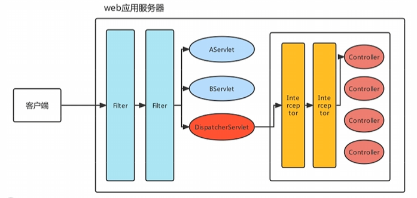
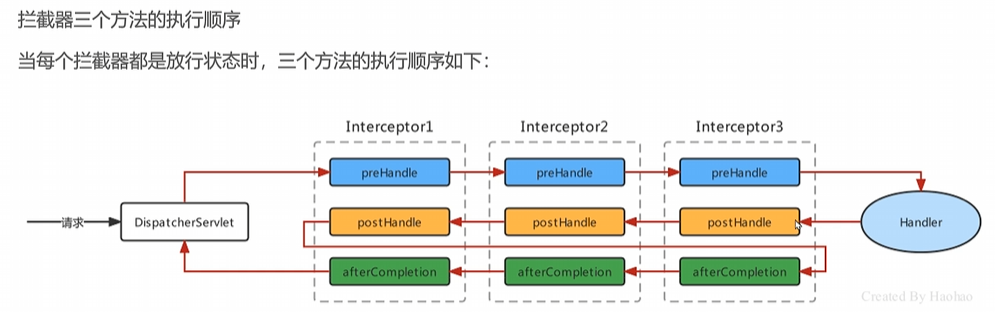

### 拦截器 Interceptor




拦截器是Spring MVC中的一个重要组件，用于在请求处理之前或之后执行一些通用的操作，如日志记录、权限检查等。拦截器可以对请求进行预处理和后处理。


| 技术 | Fliter | Interceptor |
|--- | --- | --- |
| 作用范围 | Servlet级别 | Spring MVC级别 |
| 执行顺序 | 在Servlet之前 | 晚于DispatcherServlet |
| 处理请求 | 处理请求和响应 | 只对进入Spring MVC的请求进行处理 |

### 定义拦截器
```java
@Component
public class MyInterceptor implements HandlerInterceptor {
    @Override
    public boolean preHandle(HttpServletRequest request, HttpServletResponse response, Object handler) throws Exception {
        // 在请求处理之前执行
        System.out.println("Pre Handle: " + request.getRequestURI());
        return true; // 返回true表示继续处理请求，返回false表示阻止请求继续处理
    }

    @Override
    public void postHandle(HttpServletRequest request, HttpServletResponse response, Object handler, ModelAndView modelAndView) throws Exception {
        // 在请求处理之后执行
        System.out.println("Post Handle: " + request.getRequestURI());
    }

    @Override
    public void afterCompletion(HttpServletRequest request, HttpServletResponse response, Object handler, Exception ex) throws Exception {
        // 在视图渲染完成后执行
        System.out.println("After Completion: " + request.getRequestURI());
    }
}
```

### 注册拦截器


```java
@Configuration
public class WebConfig implements WebMvcConfigurer {
    @Override
    public void addInterceptors(InterceptorRegistry registry) {
        registry.addInterceptor(new MyInterceptor())
                .addPathPatterns("/**") // 拦截所有请求
                .excludePathPatterns("/login", "/static/**"); // 排除特定路径
    }
}
```

### 全注解开发
```Java
@Configuration
@ComponentScan(basePackages = "com.example") // 扫描组件

// <mvc:annotation-driven />
@EnableWebMvc 
public class WebConfig implements WebMvcConfigurer {
    @Bean
    public CommonMultipartResolver multipartResolver() {
        return new CommonsMultipartResolver(); // 配置文件上传解析器
    }

}
```
```Java
public class MyAnnotationConfigWebApplicationContext extends AnnotationConfigWebApplicationContext {
    public MyAnnotationConfigWebApplicationContext() {
        super();
        setServletContext(new MockServletContext());
        register(WebConfig.class); // 注册配置类
    }
}
```