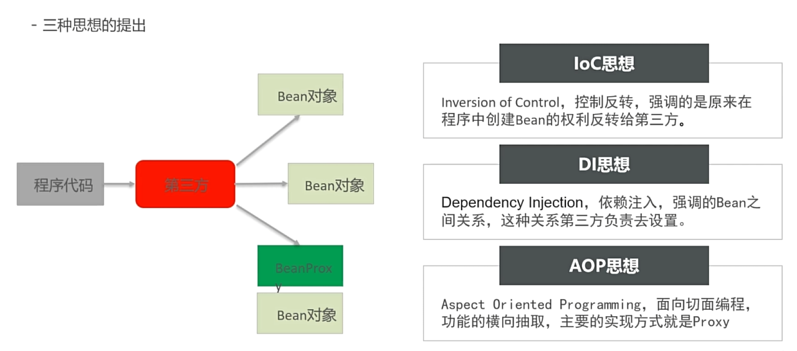

# Java Spring

[bilibili](https://www.bilibili.com/video/BV1rt4y1u7q5)

## Why Spring?
- Problem of conventional Java EE
  - 层与层之间的耦合，接口与具体实现的耦合 (Factory模式)
  - 代码的重复 -> 自动new出携带模板功能的对象 (工厂模式)

## IOC, DI, AOP


- IOC (Inversion of Control) -> Bean的创建权限交给Spring容器
  - 控制反转，Spring容器负责创建对象
  - 通过配置文件或注解来定义对象的创建和依赖关系

- DI (Dependency Injection) -> 依赖注入
  - Spring容器负责将对象的依赖关系注入到对象中
  - 可以通过构造函数注入、Setter方法注入或字段注入

- AOP (Aspect-Oriented Programming) -> 面向切面编程
    - 通过切面来定义横切关注点
    - 可以在不修改业务代码的情况下添加日志、事务等功能

## Spring framework


### BeanFactory (core of Spring)
- BeanFactory是Spring的核心容器，负责管理Bean的生命周期和依赖关系


/resources/Bean.xml
```XML
    <bean id="userService" class="com.pphui8.spring.service.impl.UserServiceImpl">
<!--        here ref correspond to id="userDao"       -->
        <property name="userDao" ref="userDao"/>
    </bean>
    <bean id="userDao" class="com.pphui8.spring.dao.impl.UserDaoImp" />
```

/test/BeanFactoryTest.java
```Java
public class BeanFactoryTest {
    public static void main(String[] args) {
        // 创建工厂对象
        DefaultListableBeanFactory beanFactory = new DefaultListableBeanFactory();
        // 创建xml读取器
        XmlBeanDefinitionReader reader = new XmlBeanDefinitionReader(beanFactory);
        // 读取器绑定工厂
        reader.loadBeanDefinitions(new ClassPathResource("Bean.xml"));
        // 根据id获取Bean实例对象
        UserService userService = (UserService) beanFactory.getBean("userService");

        UserDao userDao = (UserDao) beanFactory.getBean("userDao");

//        System.out.println(userService);
//        System.out.println(userDao);
    }
}
```

/userDao/impl/UserDaoImpl.java
```Java
public class UserServiceImpl implements UserService {
    // BeanFactory调用该方法从容器中获得userDao设置到此处
    public void setUserDao(UserDao userDao) {
        System.out.println("setUserDao has been called " + userDao);
    }
}
```

### ApplicationContext
- ApplicationContext是BeanFactory的子接口，提供了更多的功能，如国际化、事件传播等


```Java
public class ApplicationContextTest {
    public static void main(String[] args) {
//        ApplicationContext context = new ClassPathXmlApplicationContext("applicationContext.xml");
        ApplicationContext context = new ClassPathXmlApplicationContext("Bean.xml");
        UserService userService = (UserService) context.getBean("userService");
        System.out.println(userService);
    }
}
```