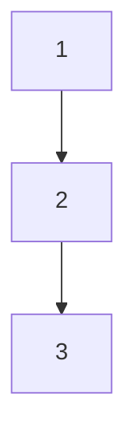
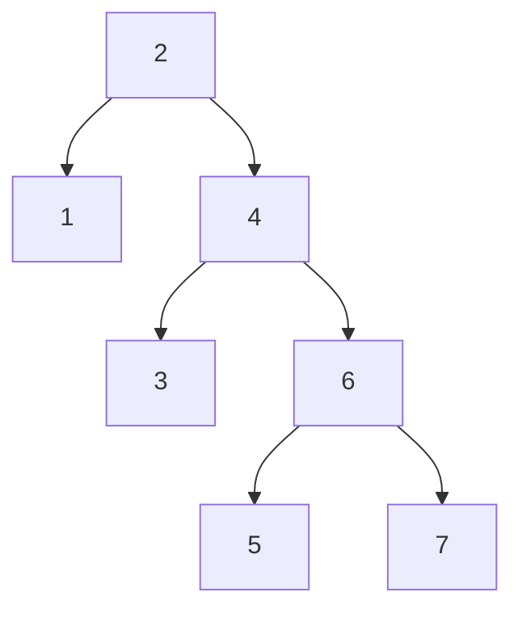

# SQL (mysql based)

*This is not for Entrance Level*

Reference:
- [Video](https://www.bilibili.com/video/BV1ge4y117cM)

### Optimization Direction
1. Transition between *Memory* and *Storage* is time consuming (Height of the Tree)
2. Time consuming of reading single and continuous elements are almost the same (B+ Tree)

## 1. Index (索引)
A `sorted` list of data that can be used to quickly find.

- Sorted Binary Tree
- Red-Black Tree
- B Tree & B+ Tree
- Hash Table

---
#### Sorted Binary Tree
Left child < Parent < Right child

**Why not use it?**  
If every node has only one child, the tree will become a linked list. The time complexity of searching will be O(n) `(Node 3)`.

---
#### Red-Black Tree
Or Self-Balancing Binary Tree. A refined version of the sorted binary tree.

- The height of the tree is always O(logn).
- The tree is balanced, so the time complexity of searching is O(logn).

**Why not use it?**
- (Extreme case) The height of the tree trends to be high, searching a leaf node will take O(logn) time `(Node 5, 7)`.

---
#### B Tree & B+ Tree
Give each node a pointer to the next node. The leaf nodes are linked together.